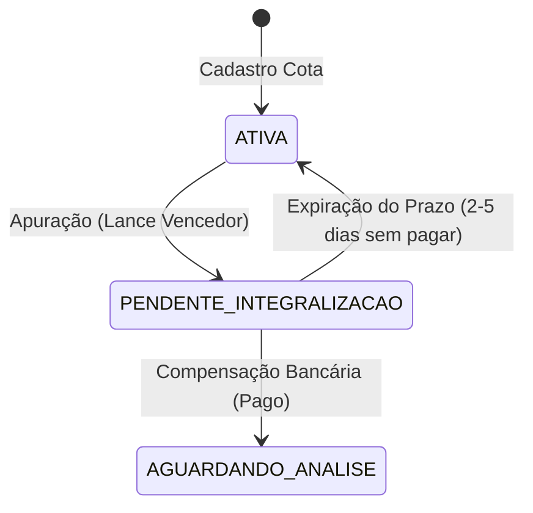

# 📝 Plano de Testes — Sprint 3 (Consórcio API)

Este documento descreve o planejamento e o roteiro de testes unitários (JUnit 5) e de integração (MockMvc) para as novas funcionalidades da Sprint 3, em estrita conformidade com as regras de negócio da **Lei 11.795/08**, as resoluções do **Banco Central do Brasil (BCB)** e as decisões arquiteturais **ADR 004** e **ADR 005**.

---

## 🎯 1. Objetivos da Sprint 3 (Foco do QA)

A Sprint 3 é focada em mitigar riscos financeiros e litígios jurídicos através de duas implementações críticas:
1.  **ADR 004 (Transição `PENDENTE_INTEGRALIZACAO`):** Homologação de lances livres com status intermediário, evitando a liberação de crédito antes da compensação bancária real do lance.
2.  **ADR 005 (Restituição de Cotas Canceladas Reajustada):** Atualização da fórmula de reembolso de cotas excluídas para usar o percentual amortizado sobre o valor atualizado do bem, deduzindo a cláusula penal de 10%.

---

## 🧮 2. Detalhamento Físico das Fórmulas de Teste

### A. Transição de Status `PENDENTE_INTEGRALIZACAO`
A transição deve seguir o fluxo de estados abaixo para garantir consistência sistêmica e de caixa:

**Regras Contábeis da Transição:**
*   No status `PENDENTE_INTEGRALIZACAO`, o crédito **não** transita para a conta contábil de `Créditos a Liberar (2.1.2.30.10-0)`.
*   Após a confirmação da integralização física do valor do lance (compensação bancária), o sistema executa:
    1.  O lançamento contábil de débito em `Fundo Comum` e crédito correspondente.
    2.  O trânsito do crédito liberado para o passivo `Créditos a Liberar`.
    3.  A alteração do status da cota para `AGUARDANDO_ANALISE`.
*   Se expirar o prazo sem pagamento:
    1.  A contemplação por lance livre é invalidada/excluída.
    2.  A cota retorna a `ATIVA`.
    3.  O motor de apuração convoca o próximo lance classificado em ordem decrescente de percentual.

---

### B. Cálculo de Reembolso Reajustado de Excluídos
A nova regra de devolução com base no valor atualizado do bem na data de contemplação da cota cancelada (Art. 30 da Lei 11.795/08) exige os seguintes passos:

1.  **Cálculo do Percentual Amortizado Acumulado ($\%_{\text{amortizado}}$):**
    $$%_{\text{amortizado}} = \sum_{p \in \text{parcelas pagas}} \left(\frac{p.\text{valorFundoComum}}{\text{Valor Crédito do Grupo na data do vencimento/geração da parcela}}\right)$$
2.  **Base de Reembolso Bruto (Fundo Comum Reajustado):**
    $$\text{Reembolso Bruto} = \%_{\text{amortizado}} \times \text{Valor do Crédito Atualizado do Grupo na data da AGO de Contemplação}$$
3.  **Desconto da Multa Rescisória (10%):**
    $$\text{Multa Rescisória} = \text{Reembolso Bruto} \times 0.10$$
4.  **Valor Líquido a Devolver:**
    $$\text{Valor Reembolsado} = \text{Reembolso Bruto} - \text{Multa Rescisória}$$

#### Massa de Teste / Exemplo Prático para Asserção Matemática:
*   **Crédito Inicial do Grupo:** R$ 100.000,00
*   **Parcela Gerada:** 100 meses. Percentual nominal mensal de Fundo Comum = 1% (R$ 1.000,00/mês).
*   **Histórico de Pagamento:** Consorciado pagou **3 parcelas** quando o crédito era R$ 100.000,00.
    *   $\%_{\text{amortizado}} = 1\% + 1\% + 1\% = 3\%$ (ou $0.03$).
    *   Total pago nominalmente ao Fundo Comum = R$ 3.000,00.
*   **Reajuste do Crédito do Grupo:** O bem foi reajustado para **R$ 120.000,00**.
*   **Contemplação por Sorteio da Cota Cancelada:** O sorteio ocorre após o reajuste.
*   **Cálculos Finais no Teste:**
    *   $\text{Reembolso Bruto} = 3\% \times R\$ 120.000,00 = R\$ 3.600,00$
    *   $\text{Multa Rescisória} = 10\% \times R\$ 3.600,00 = R\$ 360,00$
    *   $\text{Valor Líquido a Devolver} = R\$ 3.600,00 - R\$ 360,00 = R\$ 3.240,00$
    *   *Diferença para a regra antiga:* O consorciado recebe **R$ 3.240,00** em vez de R$ 2.700,00 (nominal de R$ 3.000,00 - R$ 300,00 de multa).

---

## 🧪 3. Cenários de Teste Unitário (JUnit 5 + Mockito)

### A. Roteiro para Transição de Status `PENDENTE_INTEGRALIZACAO`
Estes testes serão adicionados a `ContemplacaoServiceTest` e ao novo `MotorApuracaoServiceTest`:

#### Cenário 1: Classificação e Contemplação Inicial por Lance Livre
*   **Ação:** Chamar `apurarAssembleia(id)` no `MotorApuracaoService`.
*   **Mocks:** 
    *   `Lance` cadastrado como Lance Livre (R$ 20.000,00).
    *   Fundo comum com saldo suficiente para cobrir o impacto líquido de caixa.
*   **Passos e Validações:**
    1.  Verificar se o `StatusApuracaoLance` do lance passa para `VENCEDOR`.
    2.  Verificar se o status da `Cota` transita para `PENDENTE_INTEGRALIZACAO` (e **não** para `AGUARDANDO_ANALISE`).
    3.  Garantir que `contabilidadeService.registrarBaixa` para `Créditos a Liberar` **não** foi chamado.

#### Cenário 2: Confirmação e Compensação Bancária do Lance (Integralização)
*   **Ação:** Criar e chamar o método `confirmarPagamentoLance(idCota, idLance)` no `ContemplacaoService` ou `LanceService`.
*   **Mocks:**
    *   Cota com status `PENDENTE_INTEGRALIZACAO`.
    *   Transação simulando depósito de R$ 20.000,00.
*   **Passos e Validações:**
    1.  Verificar transição da cota para `AGUARDANDO_ANALISE`.
    2.  Validar se o lançamento contábil no Ledger foi efetuado (DÉBITO na conta de `Fundo Comum` e CRÉDITO em `Créditos a Liberar (2.1.2.30.10-0)`).
    3.  Verificar se foi gerado o registro de histórico de transição de versão da cota.

#### Cenário 3: Cancelamento de Lance por Expiração do Prazo (Inadimplência de Integralização)
*   **Ação:** Chamar o método de cancelamento por decurso de prazo.
*   **Mocks:**
    *   Cota com status `PENDENTE_INTEGRALIZACAO`.
*   **Passos e Validações:**
    1.  Verificar reversão automática do status da cota para `ATIVA`.
    2.  Validar exclusão ou cancelamento lógico do registro de `Contemplacao` associado.
    3.  Garantir a ausência de qualquer lançamento contábil de liberação de crédito no razão.

---

### B. Roteiro para Reembolso Reajustado de Cotas Canceladas
Estes testes serão adicionados a `CotaServiceTest`:

#### Cenário 1: Cálculo Exato com Reajuste Vigente
*   **Ação:** Chamar `reembolsarCota(id)` no `CotaService`.
*   **Configuração de Mocks/Massa:**
    *   Cota `CANCELADA`.
    *   Grupo com valor de crédito original R$ 100.000,00 e atualizado para R$ 120.000,00.
    *   3 parcelas pagas com `valorFundoComum` de R$ 1.000,00 cada.
*   **Passos e Validações:**
    1.  Validar se o percentual calculado é exatamente `3.00%`.
    2.  Validar se o `valorReembolsado` gravado e retornado é exatamente `3240.00`.
    3.  Validar se a `multaRescisoria` debitada é exatamente `360.00`.
    4.  Verificar se a cota passa a ter `reembolsada = true`.

#### Cenário 2: Impedimento de Duplo Reembolso
*   **Ação:** Chamar `reembolsarCota(id)` em cota com `reembolsada = true`.
*   **Passos e Validações:**
    1.  Garantir que lança `RegraDeNegocioException` com a mensagem `"Esta cota já foi reembolsada."`.
    2.  Verificar que o repositório de lançamentos e o save da cota nunca foram chamados adicionalmente.

---

## 🌐 4. Cenários de Testes de Integração (MockMvc)

### A. Confirmação de Integralização do Lance Livre
*   **Endpoint:** `POST /api/contemplacoes/lances/{id}/integralizar`
*   **Cenários a Validar:**
    1.  **Acesso Autorizado (Gestor):** Request com token contendo `ROLE_ADMIN` ou `ROLE_GESTOR`. Retorna `200 OK` e corpo com status da cota atualizado.
    2.  **Perfil Insuficiente:** Request com token de cliente comum. Retorna `403 Forbidden`.
    3.  **Token Expirado/Inexistente:** Chamada sem cabeçalho `Cookie` ou com JWT expirado. Retorna `401 Unauthorized`.
    4.  **Dados de Retorno Limpos:** Garantir que o payload JSON não contém dados sigilosos e o stack trace do Hibernate/Spring está oculto em caso de falha.

### B. Novo Cálculo de Reembolso via API
*   **Endpoint:** `POST /api/cotas/{id}/reembolsar`
*   **Cenários a Validar:**
    1.  **Cálculo Correto:** Executar chamada para cota cancelada sob grupo reajustado. Validar se o JSON do `CotaReembolsoResponseDTO` reflete os valores reajustados.
    2.  **Validação contra IDOR:** Operador tenta reembolsar cota sem permissão ou o cliente autenticado tenta reembolsar cota alheia. Retorna `403 Forbidden`.
    3.  **Resposta de Erro Genérica:** Se houver erro de consistência do banco de dados, certificar-se de que a resposta HTTP traz uma mensagem genérica limpa através do `GlobalExceptionHandler`, sem detalhes de stack trace.

---

## 📈 5. Critérios de Aceitação e Cobertura

1.  **Cobertura de Linhas:** O novo código de controle de integralização e reembolso reajustado deve atingir **100% de cobertura nos testes unitários e de integração**.
2.  **Garantia de Não-Regressão:** Executar todos os testes da suíte e verificar se os testes existentes de reajuste e contemplação continuam verdes (100% de sucesso).
3.  **Auditoria Contábil Intacta:** Validar se cada lançamento gerado possui sua respectiva contrapartida de débito/crédito no livro razão contábil.
